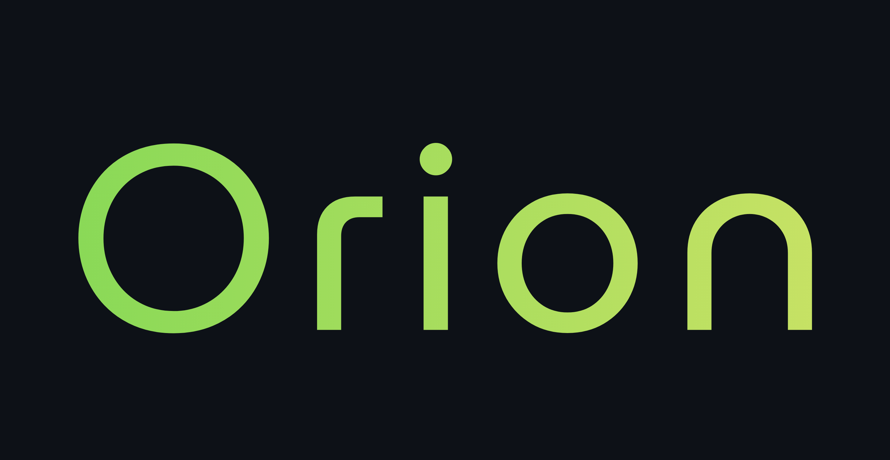

An autonomous AI agent designed to perform root-cause analysis for SRE and DevOps alerts.

When given a critical alert (e.g., `"FATAL: Database connection limit reached!"`), Orion intelligently investigates the problem, forms multiple hypotheses, queries live data sources, and provides a single, human-readable conclusion about the root cause.

-----

## 🎯 Core Concepts

This is not a simple RAG chatbot. Orion is an advanced agent built by implementing and combining several modern AI engineering concepts.

### 1\. The Agent: Tree of Thoughts (ToT)

The agent's "brain" is a **Tree of Thoughts** orchestrator built with **LangGraph**. Instead of a simple "ReAct" (Reason -\> Act) loop, Orion's process is:

1.  **EXPAND:** Generate multiple, distinct *hypotheses* for the alert (e.g., "It's a code bug," "It's a traffic spike," "It's a config issue").
2.  **EVALUATE:** Test all hypotheses *in parallel* by running queries against live data.
3.  **SYNTHESIZE:** Analyze the results from all branches, prune the failed hypotheses, and form a final conclusion.

### 2\. The "Brain": Hierarchical RAG

The agent's knowledge comes from a **Hierarchical RAG** engine built with **LlamaIndex**.

  * It ingests the `knowledge_base/` folder (containing runbooks, postmortems, etc.) and processes it into a multi-layer index (similar to the [RAPTOR](https://arxiv.org/abs/2401.18059) paper).
  * This allows the agent to answer high-level, "meta" questions (e.g., "What are common causes of outages?") and retrieve low-level, specific facts (e.g., "What is the exact config for `payment-db`?").

### 3\. The "Hands": Model Context Protocol (MCP)

The agent's tools are not simple Python functions. They are **standalone MCP servers** built with `fastmcp`.

  * **`mcp_prometheus.py`**: A server that exposes the `query_prometheus` tool.
  * **`mcp_loki.py`**: A server that exposes the `query_loki` tool.

The agent uses an `mcp-client` to connect to these servers and run its queries, just as a modern AI-native application would.

### 4\. The Sandbox: Live SRE Environment

The agent operates in a live test environment powered by **Docker Compose**. This stack includes:

  * **Prometheus:** For metrics.
  * **Loki:** For logs.
  * **Grafana:** For visualization.
  * **`fake_app.py`:** A custom Python app that generates fake metrics (like `fake_app_errors_total`) and fake "FATAL" logs for Orion to find.

-----

## 🔧 Tech Stack

  * **Agent Orchestration:** `langgraph`
  * **RAG Engine:** `llama-index`
  * **LLM:** `groq` (using `llama-3.1-8b-instant`)
  * **API / Servers:** `fastapi`, `uvicorn`, `fastmcp`
  * **SRE Stack:** `docker-compose`, `prometheus`, `loki`, `promtail`
  * **Python Tooling:** `uv` (as package manager), `pydantic`

-----

## 🚀 Getting Started

Follow these steps to run the complete Project Orion API server.

### Prerequisites

1.  **Clone the repository:**

    ```bash
    git clone https://github.com/your-username/orion.git
    cd orion
    ```

2.  **Install `uv`:**

    ```bash
    curl -LsSf https://astral.sh/uv/install.sh | sh
    ```

3.  **Install Docker Desktop:**

      * Make sure the Docker daemon is running.

4.  **Get Groq API Key:**

      * Create an account at [GroqCloud](https://console.groq.com/keys).
      * Create a `.env` file in the root of the `orion` folder.
      * Add your key to it:
        ```
        GROQ_API_KEY="gsk_YourSecretKeyGoesHere"
        ```

### Step 1: Install Dependencies

Activate your Python 3.13+ environment and install all packages from the `uv.lock` file.

```bash
uv venv
source .venv/bin/activate
uv sync
```

### Step 2: Run the SRE Sandbox

In your first terminal, start the Docker Compose stack. This will launch Prometheus, Loki, Grafana, and the `fake_app`.

```bash
docker-compose up -d
```

You can verify this is working by opening your Grafana dashboard at `http://localhost:3000`.

### Step 3: Run the Project Orion API

In your second terminal (with the `.venv` activated), run the FastAPI server.

```bash
uvicorn src.api:app --host 0.0.0.0 --port 8000
```

Your agent is now live and listening for requests at `http://localhost:8000`.

-----

## 🔬 How to Test

You can test the agent in two ways:

### 1\. Test with the CLI (Simple)

Run the `main.py` script from your terminal.

```bash
uv run -m src.main "FATAL: Database connection limit reached!"
```

You will see the full pipeline run in your terminal, followed by the final conclusion.

### 2\. Test with the API (for Frontend)

Use `curl` (or a tool like Postman/Insomnia) to send a request to your live API.

```bash
curl -X POST http://localhost:8000/diagnose \
-H "Content-Type: application/json" \
-d '{
    "alert": "FATAL: Database connection limit reached!"
}'
```

You will get a JSON response like this:

```json
{
  "conclusion": "Based on the investigation, the root cause... (etc)"
}
```